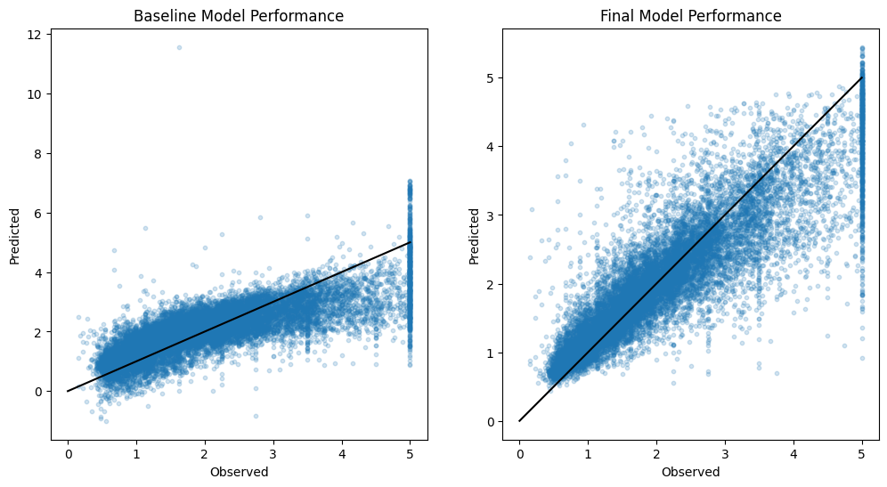

# California Housing

## Data and problem description:

**Problem:** Predict houses value based on the California Housing dataset.

The target variable is the median house value for California districts,
expressed in hundreds of thousands of dollars ($100,000).

Attributes:  

- MedInc - median income in block group
- HouseAge - median house age in block group
- AveRooms - average number of rooms per household
- AveBedrms - average number of bedrooms per household
- Population - block group population
- AveOccup - average number of household members
- Latitude - block group latitude
- Longitude - block group longitude

This dataset was obtained from the StatLib repository
https://www.dcc.fc.up.pt/~ltorgo/Regression/cal_housing.html

## Model summary:

- I used a VotingEstimator combining KNeighbors and LinearRegression models to integrate simple and intuitive methods for modeling location impact and numeric data.
- KNeighbors model was used for geocoordinate data (predicting based on literal neighbors). The model utilized 5 neigboring data points weighted by their distance using the Manhattan metric.
- For numeric data, I employed a simple Linear Regression. My intention was to use possibly the simplest models.
- Optimal model hyperparameters and preprocessing details were obtained during a few rounds of hyperparameter tuning. The model variants were lightweight enough to utilize the GridSearch method.
- A few outliers were identified during EDA (possibly wrong data deduced based on distributions and self-evident errors inconsistent to common sense). They were removed and imputed with a IterativeImputer method.
- MinMaxScaler was chosen as the optimal scaling method for geocoordinate data and StandardScaler was utilized for numeric data.
- The use of regularization methods (Ridge and Lasso Regression) led to subpar results and was therefore rejected.

## Model interpretation

- The optimal voting weigths for KNeigbors and LinearRegression, derived through hyperparameter tuning, were set to 0.8 to 0.2 respectively. This implies that the most impactful features in the model were geocoordinate data, aka the location.
- This aligns with the common adage that the key factors for house prices are "location, location, location". ;)
- The most crucial numeric feature was Median Income, followed by Average Bedrooms.

## Results:  

The Final Model proved to provide better results compared to the Baseline Model (Vanilla Linear Regression with minimal preprocessing).

On the plots, we can see a reduction in both bias and variance, resulting in an improvement in all the metrics compared in the table below.

Metric | Baseline | Final
--- | --- | ---
observed_median | 1.7985 | 1.7985
predicted_median | 2.0254 | 1.8620
MAE | 0.5295 | 0.3690
MSE | 0.5218 | 0.3092
MAPE | 0.3181 | 0.2064
R2_score | 0.6070 | 0.7671

